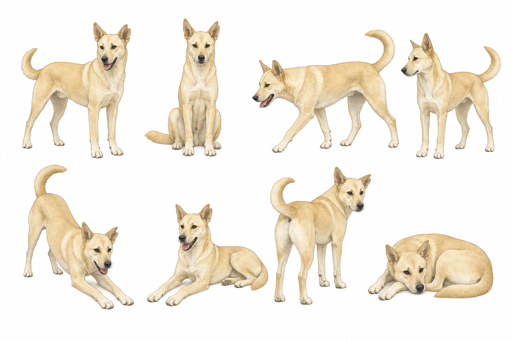
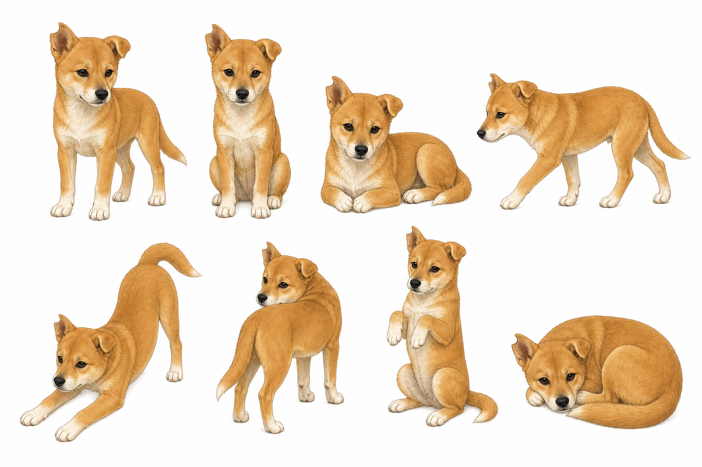
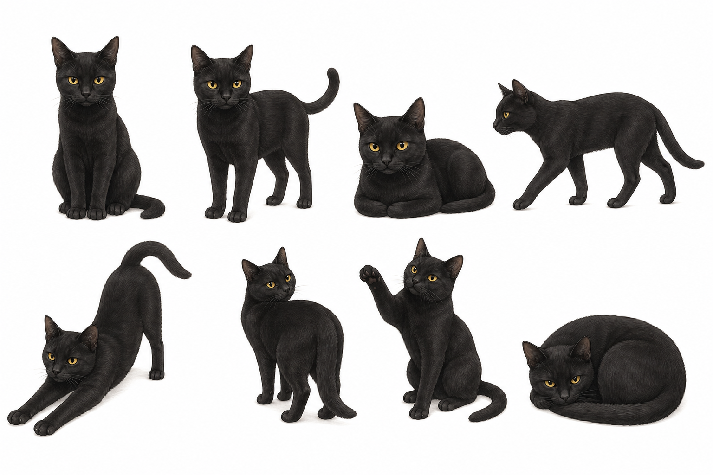
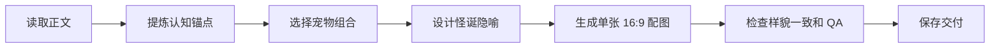

# 宠物配图 Skill

为中文文章生成 Ian 风格的怪诞正文配图：纯白背景、黑色手绘线稿、少量红/橙/蓝中文批注，并固定使用三只宠物作为视觉主角。

这个 skill 的重点不是生成萌宠海报，也不是画正式 PPT 流程图，而是把文章里的判断、流程、结构、状态或隐喻，转成一张清爽、有点怪、但能快速看懂的正文插图。

## 固定主角

三只宠物来自本 skill 根目录，图片文件名就是角色名。生成时必须保持宠物样貌和参考图一致，不能只画成“类似的猫狗”。

| 小黄 | 小狗儿 | 蒂娜 |
|---|---|---|
|  |  |  |
| 浅黄大狗，修长体型，直立大耳，上卷尾巴 | 橙黄小狗，白胸白爪，一耳立一耳半垂 | 黑猫，黄眼睛，尖耳朵，细长身体 |
| 适合探路、拉路径、守门、发现断点 | 适合试探、卡住、提问、钻入口 | 适合观察、判断、按开关、校验 |

## 样貌一致硬规则

使用 Ian / ifan 风格时，三张 PNG 是权威参考，不是灵感图。

必须做到：

- 生成前查看或读取 `小黄.png`、`小狗儿.png`、`蒂娜.png`。
- 保持物种、体型、毛色、耳朵、尾巴、脸型、眼睛和典型姿态。
- 只做 Ian 风格线稿转译，不改成通用萌宠、贴纸、毛绒玩具、儿童卡通或新角色。
- 如果生图工具不能把参考图作为视觉输入，只能说明是草稿，不能声称“样貌严格一致”。

提示词里必须明确包含：

```text
match the provided reference images closely
preserve identity from the reference PNGs
do not invent a generic pet
```

## 适合做什么

适合用于：

- 中文文章正文配图
- 博客 / Notion / 长文插图
- 方法论、流程、结构、状态、隐喻图
- 技术概念解释图，例如 TCP/IP、DNS、缓存、队列、工作流
- “哪里应该配图”的 shot list 策略

不适合用于：

- 宠物写真
- 萌宠头像
- 商业插画
- PPT 信息图
- 正式系统架构图
- 复杂 UI 截图复刻

## 工作流



## 宠物组合规则

每张图从三只宠物中选择 1-3 只出场。随机组合要服从表达，不要为了随机而牺牲结构清晰度。

| 组合 | 适合场景 |
|---|---|
| 单只 | 一个明确动作、一个判断、一个状态 |
| 双只 | 对比、协作、拉扯、输入输出、角色分工 |
| 三只 | 系统分流、闭环、多阶段、共同搬运一个抽象物 |

常用组合：

- `小黄`：推进、开路、寻找断点、承接路径。
- `小狗儿`：试错、卡住、提问、误入入口。
- `蒂娜`：判断、审核、观察、按住关键点。
- `小黄 + 小狗儿`：执行与试探。
- `小黄 + 蒂娜`：推进与审核。
- `小狗儿 + 蒂娜`：疑问与纠偏。
- `小黄 + 小狗儿 + 蒂娜`：分流、闭环、多阶段协作。

## 对话规则

可以加少量短对话，但不能变成剧情漫画。

- 每张图最多 1-3 个气泡。
- 每个气泡 2-8 个中文字符。
- 对话要服务当前结构表达。
- 小黄负责推进，小狗儿负责试探，蒂娜负责判断。

示例：

```text
小黄：“走这边”
小狗儿：“我试试”
蒂娜：“先校验”
```

## 使用示例

### 生成一张技术解释图

```text
Use $ian-xiaohei-illustrations 为“A 发送一条消息到 B 接收一条消息”的过程画一张 Ian 宠物风格正文配图，要求详细 TCP/IP。必须保持小黄、小狗儿、蒂娜的样貌和参考图片一致。
```

### 为文章做配图策略

```text
Use $ian-xiaohei-illustrations 分析这篇文章适合在哪些段落后配图，给我 4-6 张 shot list，不要先生成图片。
```

### 指定宠物组合

```text
Use $ian-xiaohei-illustrations 画一张“缓存击穿”的正文配图，只用小狗儿和蒂娜。小狗儿负责试探入口，蒂娜负责按住校验开关。
```

## 生成提示词骨架

```text
Generate one standalone 16:9 horizontal Chinese article illustration.

Visual DNA:
Pure white background. Minimalist black hand-drawn line art. Slightly wobbly pen lines. Lots of empty white space. Sparse red/orange/blue handwritten Chinese annotations.

Pet identity requirement:
Use the provided reference PNGs for 小黄, 小狗儿, 蒂娜. Match the provided reference images closely. Preserve identity from the reference PNGs. Do not invent a generic pet.

Selected pet combination:
{小黄 / 小狗儿 / 蒂娜 / 小黄+小狗儿 / 小黄+蒂娜 / 小狗儿+蒂娜 / 小黄+小狗儿+蒂娜}

Core idea:
{这张图要表达的核心意思}

Composition:
{宠物在哪里、正在做什么、主要物件是什么、信息如何流动}

Chinese labels:
{短标注 1} / {短标注 2} / {短标注 3}

Dialogue bubbles if useful:
{宠物名：“短句”；没有必要就 none}
```

## QA 清单

生成后至少检查这些项：

- 是 16:9 横版。
- 背景是干净白底。
- 宠物承担核心动作，不只是装饰。
- 宠物样貌贴近根目录 PNG。
- 没有变成通用猫狗、贴纸、毛绒玩具或萌宠海报。
- 中文标注少、短、能读。
- 对话气泡不超过 1-3 个。
- 没有左上角标题、正式流程图味、PPT 味。
- 一张图只讲一个核心结构。

## 文件结构

```text
Images of cats and dogs/
├── SKILL.md
├── README.md
├── pet-roster.md
├── 小黄.png
├── 小狗儿.png
├── 蒂娜.png
├── agents/
│   └── openai.yaml
└── references/
    ├── composition-patterns.md
    ├── pet-protagonists.md
    ├── pet-roster.md
    ├── prompt-template.md
    ├── qa-checklist.md
    └── style-dna.md
```

## 维护建议

如果以后替换宠物图片：

1. 保持图片文件名就是角色名。
2. 更新根目录 `pet-roster.md`。
3. 同步更新 `references/pet-roster.md`。
4. 检查 `SKILL.md` 中的固定角色名和参考图路径。
5. 重新测试一次“样貌一致硬规则”。